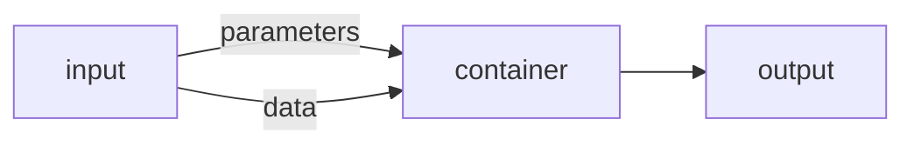

# Tool specification

## Overview

This document describes specifications for generic [`Tool`](./tool.md) entities. A `Tool` is:
*  any executable software
*  contained in a docker (compatible) container 
*  transforms [`Input`](./input.md) consisting of optional [`Parameters`](./input.md#parameters-file-specification) and optional [`Data`](./input.md#data-file-specification) into output

A very simplified workflow of a tool execution looks like the flowchart below:

The main objective is to create a communitiy-driven tool interface specification, 
that is language-agnostic and can be implemented a layer *below* more tool-specific 
frameworks, like modeling interfaces.
This helps to increase interoperability and reproducibility, especially in a 
scientific context.

At the same time, the tool specification does not rely upon a metadata-schema, 
which is either tool-specific or very generic. But the tool specification can be
extended by any metadata schema.

## Contributing

To contribute to this specification, you can create a [Fork](https://github.com/tool-spec/tool-specs/fork) 
of the repository and adapt as you suggest. Then open a [Pull Request](https://github.com/tool-spec/tool-specs/compare) and your changes will be reviewed.

If you like to review upcoming changes, you can mail [@mmaelicke](https://github.com/mmaelicke)
or [@AlexDo1](https://github.com/AlexDo1) to make you an outside collaborator 
of this specification.

## Implementations

This section lists the implementations, which we are aware of. By *implementation*, 
we are referring to software packages for different programming languages used
in either of the tools, that help to parse the *parametrization* and the *input data* of a tool into
a language specific data structure. Here, you can read more about [parameter and data input](./input.md).

The recommended approach is **[gotap](https://github.com/tool-spec/gotap)**. It generates language-specific parameter bindings from `tool.yml` at container build time and is used by all templates. For legacy support, language-specific libraries are also available.

|  library          | Language          |  source repository                          | install                       |  template repo                                    |
|:------------------|:-----------------:|:-------------------------------------------:|:-----------------------------:|:-------------------------------------------------:|
| **gotap**         | All (via generate) | https://github.com/tool-spec/gotap          | built into container          | all templates below                               |
| `json2args`       | Python 3.X        | https://github.com/tool-spec/json2args | `pip install json2args`         | https://github.com/tool-spec/tool_template_python | 
| `json2aRgs`       | R > 3.4           | https://github.com/tool-spec/r-json2aRgs | `install.packages("json2aRgs")` | https://github.com/tool-spec/tool_template_r      | 
| `js2args`         | NodeJS > 14       | https://github.com/tool-spec/js2args      | `npm install js2args`           | https://github.com/tool-spec/tool_template_node   | 
| `getParameters.m` | Octave / MATLAB   | https://github.com/tool-spec/tool_template_octave | :x:                     | https://github.com/tool-spec/tool_template_octave | 

The table below lists which implementation exists and what parts of the
tool specification are already covered:

|  specification        |  gotap (all)             | json2args (Python 3.X)  | json2aRgs (R)      |  getParameters.m (Octave / MATLAB)  |  js2args (Node.js). |
|:----------------------|:------------------------:|:------------------------:|:------------------:|:-----------------------------------:|:-------------------:|
|    **Parameter Types**                                                                                                        |||
| string                | :heavy_check_mark:       | :heavy_check_mark:       | :heavy_check_mark: | :heavy_check_mark:                  | :heavy_check_mark:  |
| integer               | :heavy_check_mark:       | :heavy_check_mark:       | :heavy_check_mark: | :heavy_check_mark:                  | :heavy_check_mark:  |
| float                 | :heavy_check_mark:       | :heavy_check_mark:       | :heavy_check_mark: | :heavy_check_mark:                  | :heavy_check_mark:  |
| enum                  | :heavy_check_mark:       | :heavy_check_mark:       | :heavy_check_mark: | :heavy_check_mark:                  | :heavy_check_mark:  |
| enum -check values    | :heavy_check_mark:       | :heavy_check_mark:       | :x:                | :x:                                 | :x:                 |
| boolean               | :heavy_check_mark:       | :heavy_check_mark:       | :heavy_check_mark: | :grey_question:                     | :grey_question:     |
| datetime              | :heavy_check_mark:       | :heavy_check_mark:       | :heavy_check_mark: | :x:                                 | :heavy_check_mark:  |
| asset                 | :heavy_check_mark:       | :x:                      | :x:                | :x:                                 | :x:                 |
|    **Parameter fields**                                                                                                       |||
| array                 | :heavy_check_mark:       | :heavy_check_mark:       | :heavy_check_mark: | :grey_question:                     | :grey_question:     |
| default               | :heavy_check_mark:       | :heavy_check_mark:       | :heavy_check_mark: | :x:                                 | :x:                 |
| min & max             | :heavy_check_mark:       | :heavy_check_mark:       | :heavy_check_mark: | :x:                                 | :x:                 |
|    **Data fields**                                                                                                            |||
| extension - `.dat`    | :heavy_check_mark:       | :heavy_check_mark:       | :heavy_check_mark: | :x:                                 | :x:                 |
| extension - `.csv`    | :heavy_check_mark:       | :heavy_check_mark:       | :heavy_check_mark: | :x:                                 | :x:                 |
| extension - `.nc`     | :heavy_check_mark:       | :heavy_check_mark:       | :x:                | :x:                                 | :x:                 |
| extension - `.json`   | :heavy_check_mark:       | :heavy_check_mark:       | :x:                | :x:                                 | :x:                 |
| empty input     *     | :heavy_check_mark:       | :x:                      | :x:                | :x:                                 | :x:                 |
| wildcards             | :heavy_check_mark:       | :heavy_check_mark:       | :x:                | :x:                                 | :x:                 |

\* `empty input` refers to the input specification requiring implementations to be able to handle empty or missing `/in/input.json` by returing an appropriate empty data structure

## Frameworks

Frameworks refer to software implementations, that run tools for you. Running tool containers
directly by operating the docker/podman CLI is the most low-level option and always possible.
The listed solutions will take some of the management boilerplate from you and
might turn out useful.

* [gorun](https://github.com/tool-spec/gorun) (Go)
* [`toolbox-runner`](https://github.com/tool-spec/tool-runner) (Python)
* [`tool-runner-js`](https://github.com/tool-spec/tool-runner-js) (NodeJS)

## Contents

* [`Container`](container.md) structure
* [`Tool`](./tool.md) specification
* [`Input (Parameters and Data)`](./input.md) specification
